# inventory_pbp

Link adaptable: https://chocostock.adaptable.app/
Link PaaS: 

## TUGAS 6

## Jelaskan perbedaan antara asynchronous programming dengan synchronous programming.
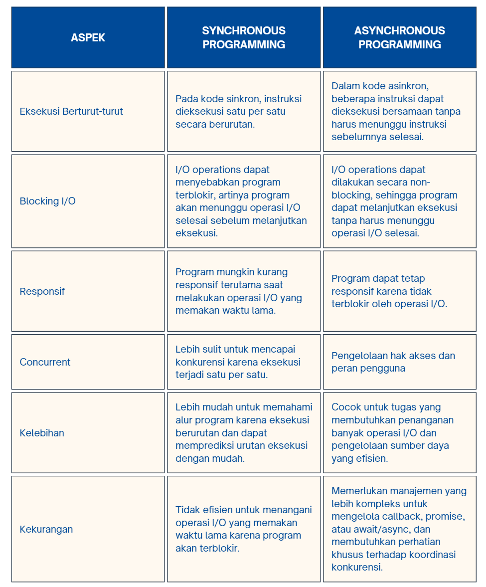

## Dalam penerapan JavaScript dan AJAX, terdapat penerapan paradigma event-driven programming. Jelaskan maksud dari paradigma tersebut dan sebutkan salah satu contoh penerapannya pada tugas ini.
Paradigma "event-driven programming" adalah suatu pendekatan dalam pemrograman yang berfokus pada pengelolaan dan penanganan peristiwa (events) yang terjadi dalam program komputer. Dalam konteks JavaScript dan AJAX, paradigma ini sangat relevan karena banyak interaksi pengguna pada aplikasi web modern terjadi berdasarkan peristiwa, seperti klik tombol, pengisian formulir, pergerakan mouse, atau permintaan HTTP yang selesai. Berikut adalah penjelasan lebih rinci tentang paradigma event-driven programming dalam konteks JavaScript dan AJAX:

1. Peristiwa (Events): Peristiwa adalah tindakan atau kejadian yang terjadi dalam sistem atau aplikasi. Dalam JavaScript, peristiwa dapat mencakup hal-hal seperti klik mouse, ketikan keyboard, pengiriman formulir, atau pembaruan elemen HTML. Dalam AJAX, peristiwa dapat mencakup respon dari server setelah permintaan HTTP selesai.

2. Penanganan Peristiwa (Event Handling): Paradigma event-driven programming mengharuskan pengembang untuk menentukan tindakan atau fungsi yang harus dijalankan ketika suatu peristiwa tertentu terjadi. Dalam JavaScript, kita dapat menetapkan fungsi penangan peristiwa (event handler) ke elemen HTML tertentu atau objek JavaScript yang ingin diawasi. Fungsi ini akan dijalankan secara otomatis ketika peristiwa tersebut terjadi.

3. Asinkron: Salah satu ciri penting dari paradigma event-driven programming adalah asinkronitas. Artinya, program dapat melanjutkan eksekusi tanpa harus menunggu peristiwa tertentu selesai. Misalnya, ketika ingin membuat permintaan AJAX, program dapat melanjutkan eksekusi selanjutnya tanpa harus menunggu respon dari server.

4. Callback Functions: Dalam JavaScript dan AJAX, callback function sangat umum digunakan untuk menangani peristiwa. kita dapat menetapkan fungsi yang akan dipanggil saat peristiwa tertentu terjadi. Misalnya, saat permintaan AJAX selesai, kita dapat menetapkan callback function yang akan mengelola data yang diterima dari server.

5. Publikasi-Subskripsi (Publish-Subscribe): Paradigma ini memungkinkan komunikasi antara berbagai bagian program yang mungkin berada di tempat-tempat yang berbeda. Kita dapat mendaftarkan objek atau fungsi untuk menerima pemberitahuan (subscribe) ketika suatu peristiwa terjadi, dan objek tersebut akan diberitahu (publish) saat peristiwa terjadi.

## Jelaskan penerapan asynchronous programming pada AJAX.
Asynchronous JavaScript and XML (AJAX) adalah teknik pengembangan web yang memungkinkan pengambilan atau pengiriman data dari atau ke server tanpa harus memuat ulang seluruh halaman web. AJAX memanfaatkan asynchronous programming untuk melakukan operasi ini tanpa mengganggu interaktivitas pengguna. Berikut adalah cara penerapan asynchronous programming pada AJAX:
- Inisiasi Permintaan: Pertama-tama, AJAX akan membuat "surat" khusus yang akan digunakan untuk meminta data dari server. Surat ini akan berisi semua detail tentang permintaan user.
- Kirim Surat ke Pos: Setelah surat user siap, AJAX akan mengirimkannya ke server tanpa harus menunggu balasan. Ini seperti mengirim surat melalui pos dan user tidak perlu menunggu jawabannya sebelum melakukan hal lain.
- Lakukan Tugas Lain: Sementara AJAX menunggu balasan dari server, halaman web tetap responsif. Artinya, user bisa melakukan hal-hal lain di situs tersebut tanpa harus menunggu.
- Terima Balasan: Setelah server menerima surat user dan menanggapinya, AJAX akan memeriksa balasan itu. Jika semuanya baik-baik saja, itu akan memberi tahu situs web user.
- Periksa Balasan: AJAX akan memeriksa isi balasan dan melakukan hal-hal yang diperlukan dengan datanya. Mungkin memperbarui bagian dari halaman tanpa harus memuat ulang seluruhnya.
- Tampilkan Hasil: Akhirnya, situs web akan menampilkan hasil dari permintaan user kepada user. Ini bisa berupa pesan yang user kirim atau mungkin hasil dari operasi lain yang user lakukan.

## Pada PBP kali ini, penerapan AJAX dilakukan dengan menggunakan Fetch API daripada library jQuery. Bandingkanlah kedua teknologi tersebut dan tuliskan pendapat kamu teknologi manakah yang lebih baik untuk digunakan.
Berikut adalah perbandingan antara Fetch API dan jQuery untuk penggunaan AJAX:

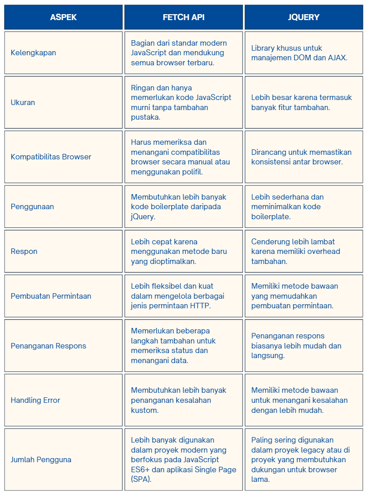

Pilihan antara Fetch API dan jQuery tergantung pada kebutuhan proyek dan preferensi pengembang. Jika kita bekerja dalam proyek modern yang berfokus pada JavaScript ES6+ dan berusaha untuk meminimalkan ketergantungan pustaka pihak ketiga, menggunakan Fetch API adalah pilihan yang baik. Di sisi lain, jika bekerja dalam proyek yang memerlukan kompatibilitas browser yang luas atau membutuhkan banyak fitur tambahan seperti animasi, manipulasi DOM, dan utilitas lainnya, jQuery masih merupakan pilihan yang valid.Sesuai dengan tren industri saat ini, mengandalkan Fetch API dan JavaScript modern dapat memberikan keuntungan dalam hal kinerja dan efisiensi. Namun, dalam beberapa kasus, terutama di proyek-proyek legacy atau di mana kompatibilitas browser yang lebih lama sangat penting, jQuery masih lebih baik untuk digunakan.

## Jelaskan bagaimana cara kamu mengimplementasikan checklist di atas secara step-by-step (bukan hanya sekadar mengikuti tutorial).
Mengubah tugas 5 yang telah dibuat sebelumnya menjadi menggunakan AJAX.
- AJAX GET
    - Ubahlah kode cards data item agar dapat mendukung AJAX GET.
        Kode sudah mendukung AJAX GET dengan menggunakan fetch untuk mengambil data produk dari . Data ini kemudian digunakan untuk memperbarui tampilan produk tanpa harus me-refresh seluruh halaman.
    
    - Lakukan pengambilan task menggunakan AJAX GET.
        - Pada Kode HTML: Fungsi getProducts() sudah ada di dalam kode HTML. Ini adalah fungsi yang mengambil data produk menggunakan AJAX GET.
        
        - Pada Fungsi refreshProducts(): Setelah mendapatkan data produk dengan menggunakan getProducts(), tampilan produk diperbarui dengan data baru. Ini termasuk membuat elemen card baru untuk setiap produk dan menambahkannya ke dalam kontainer produk.

- AJAX POST
    - Buatlah sebuah tombol yang membuka sebuah modal dengan form untuk menambahkan item.
        - Pada Kode HTML:Terdapat tombol dengan kelas btn btn-primary yang memiliki atribut data-bs-toggle="modal" dan data-bs-target="#addProductModal". Tombol ini memicu pembukaan modal.
        - Pada Modal untuk Menambahkan Produk Baru: Modal memiliki ID addProductModal.

    - Modal di-trigger dengan menekan suatu tombol pada halaman utama. Saat penambahan item berhasil, modal harus ditutup dan input form harus dibersihkan dari data yang sudah dimasukkan ke dalam form sebelumnya.
        - Setelah form disubmit, fungsi addProduct() akan dipanggil. Fungsi ini mengirimkan data form menggunakan metode POST dengan AJAX
        - Setelah berhasil, refreshProducts() akan dipanggil untuk memperbarui tampilan produk.
        - Setelah pengiriman berhasil, form akan direset menggunakan document.getElementById("form").reset() untuk membersihkan data yang telah dimasukkan.
        - Modal akan ditutup secara otomatis karena tombol "Add Product" dalam modal memiliki atribut data-bs-dismiss="modal".

    - Buatlah fungsi view baru untuk menambahkan item baru ke dalam basis data.
        Menambahkan view baru dalam Django yang akan menangani permintaan untuk menambahkan item baru. Proses ini melibatkan pengiriman data dari formulir modal ke server.

    - Buatlah path /create-ajax/ yang mengarah ke fungsi view yang baru kamu buat.
        Dalam file urls.py aplikasi, menambahkan path baru yang akan menangani permintaan POST dari formulir modal.

    - Hubungkan form yang telah kamu buat di dalam modal kamu ke path /create-ajax/.
        Di dalam formulir modal, pastikan atribut action mengarah ke path /create-ajax/ yang telah ditambahkan sebelumnya.

    - Lakukan refresh pada halaman utama secara asinkronus untuk menampilkan daftar item terbaru tanpa reload halaman utama secara keseluruhan.
        Setelah berhasil menambahkan item melalui AJAX POST, saya telah mengimplementasikan metode asinkron untuk memperbarui daftar item tanpa perlu me-refresh seluruh halaman.
- Melakukan perintah collectstatic.
    Melakukan perubahan di  settings.py, pada bagian static_root yang sebelumnya 'static' diubah menjadi 'staticfiles' lalu pada cmd melakukan python manage.py collectstatic

Referensi:
- 
- 

## TUGAS 5
## Jelaskan manfaat dari setiap element selector dan kapan waktu yang tepat untuk menggunakannya.
- Universal Selector (*):
    - Manfaat: Memilih semua elemen di halaman.
    - Waktu yang tepat untuk Menggunakan: ketika mereset atau menetapkan gaya default untuk semua elemen di halaman.
- Element Selector (Tag Selector):
    - Manfaat: Memilih semua elemen dengan tag yang spesifik 
    - Waktu yang tepat untuk menggunakan: ketika ingin menerapkan gaya yang sama pada semua elemen dengan tag tertentu.
- Class Selector (.nama-kelas):
    - Manfaat: Memilih elemen berdasarkan kelas yang diberikan.
    - Waktu yang tepat untuk menggunakan: ketika ingin menerapkan gaya yang sama pada beberapa elemen atau grup elemen.
- ID Selector (#nama-id):
    - Manfaat: Memilih elemen dengan ID yang spesifik.
    - Waktu yang tepat untuk menggunakan: ketika ingin menerapkan gaya atau perilaku unik pada satu elemen tertentu.
- Descendant Selector (Space):
    - Manfaat: Memilih elemen yang merupakan anak atau keturunan dari elemen tertentu.
    - Waktu yang tepat untuk menggunakan: ketika ingin menerapkan gaya pada elemen yang berada di dalam elemen tertentu.
- Adjacent Sibling Selector (+):
    - Manfaat: Memilih elemen yang sejajar (saudara sejajar) dari elemen tertentu.
    - Waktu yang tepat untuk menggunakan: ketika ingin menerapkan gaya pada elemen yang berada tepat setelah elemen lain dari jenis yang sama.
- Pseudo-Class Selector (:pseudo-class):
    - Manfaat: Memilih elemen berdasarkan keadaan atau perilaku tertentu (seperti :hover, :active, dsb.)
    - Waktu yang tepat untuk menggunakan: ketika ingin menerapkan gaya berdasarkan interaksi pengguna atau keadaan elemen.

## Jelaskan HTML5 Tag yang kamu ketahui.
(Menggunakan <>)
- !DOCTYPE html: Deklarasi/spesifikasi untuk menunjukkan bahwa halaman web menggunakan versi HTML5.
- html: Tag ini menandai awal dan akhir dari dokumen HTML.
- head: Bagian ini berisi informasi mengenai dokumen, seperti judul, karakter set, dan referensi ke file eksternal.
- title: Digunakan di dalam <head> untuk menentukan judul halaman web yang akan ditampilkan di jendela atau tab browser.
- meta: Diperlukan untuk mengatur informasi meta-data seperti karakter set, deskripsi halaman, dan instruksi untuk mesin pencari.
- link: Biasanya digunakan untuk menghubungkan halaman HTML ke file eksternal seperti stylesheet CSS.
- script: Digunakan untuk memasukkan atau merujuk ke skrip JavaScript. Bisa ditempatkan di head atau body.
- body: Ini adalah tempat utama untuk konten yang akan ditampilkan di halaman web, seperti teks, gambar, video, dll.
- h1, h2, ..., h6: Tag ini digunakan untuk menandai judul atau heading di halaman web, di mana h1 adalah yang tertinggi dan h6 adalah yang terendah.
- p: Digunakan untuk menandai sebuah paragraf teks.
- a: Digunakan untuk membuat tautan atau hyperlink ke halaman atau sumber daya eksternal.
- img: Digunakan untuk menampilkan gambar di halaman web.
- ul, ol, li: Tag ini digunakan untuk membuat daftar tak terurut (unordered list) dan terurut (ordered list), berserta elemen-elemennya.
- div: Tag ini digunakan untuk mengelompokkan elemen HTML dan menerapkan gaya atau CSS pada kelompok tersebut.
- span: Sama seperti 
, tetapi digunakan untuk mengelompokkan elemen dalam baris atau sekelompok elemen dalam satu baris.
- form: Digunakan untuk membuat formulir yang dapat mengirim data ke server.
- input: Digunakan dalam formulir untuk mendefinisikan berbagai jenis input seperti teks, kata sandi, kotak centang, dll.
- button: Digunakan untuk membuat tombol di dalam formulir.
- textarea: Digunakan untuk membuat area teks yang lebih besar, seperti kolom komentar.
- canvas: Digunakan untuk menggambar grafik atau membuat animasi menggunakan JavaScript.
- section, article, aside, header, footer: Ini adalah elemen blok yang memudahkan untuk mengelompokkan dan memahami struktur halaman web.
- nav: Digunakan untuk menandai area navigasi di halaman web.
- main: Menandai konten utama dari halaman web.
- time: Digunakan untuk menandai informasi waktu atau tanggal.
- header dan footer: Digunakan untuk mendefinisikan bagian kepala dan kaki dari halaman atau bagian dari halaman.

## Jelaskan perbedaan antara margin dan padding.
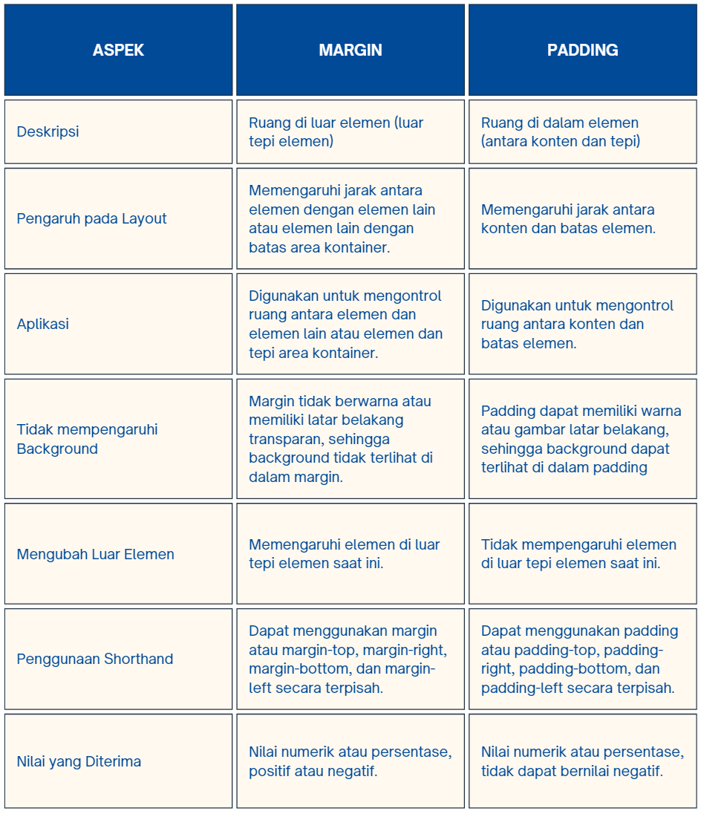

## Jelaskan perbedaan antara framework CSS Tailwind dan Bootstrap. Kapan sebaiknya kita menggunakan Bootstrap daripada Tailwind, dan sebaliknya?
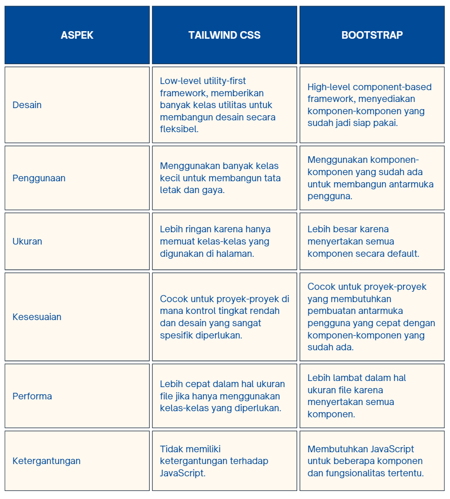

Jadi, pilihan antara Tailwind CSS dan Bootstrap tergantung pada kebutuhan proyek. Tailwind cocok untuk proyek-proyek di mana kontrol tingkat rendah dan desain yang sangat spesifik diperlukan, sementara Bootstrap cocok untuk proyek-proyek yang membutuhkan pembuatan antarmuka pengguna yang cepat dengan menggunakan komponen-komponen yang sudah ada.

## Jelaskan bagaimana cara kamu mengimplementasikan checklist di atas secara step-by-step (bukan hanya sekadar mengikuti tutorial).
Kustomisasi desain pada templat HTML yang telah dibuat pada Tugas 4 dengan menggunakan CSS atau CSS framework (seperti Bootstrap, Tailwind, Bulma) dengan ketentuan sebagai berikut

- Kustomisasi halaman login, register, dan tambah inventori semenarik mungkin.
    - Halaman login:
        1. Mewarisi dari Template Dasar (extends 'base.html'):Template ini mewarisi atau memperluas dari template dasar dengan nama 'base.html'. Ini berarti halaman login akan mengadopsi struktur dan elemen dari template 'base.html'.
        2. Mengatur Judul Halaman ():Di dalam blok meta, judul halaman diatur menjadi "Login". Hal ini memungkinkan untuk menentukan judul halaman spesifik untuk halaman login.
        3. Kustomisasi Gaya Tampilan ():Di dalam blok content, terdapat penyesuaian tampilan menggunakan CSS. Beberapa penyesuaian termasuk pengaturan latar belakang, warna teks, dan tata letak elemen.
        4. Mengatur Latar Belakang:Latar belakang halaman diatur menggunakan CSS. Gambar latar belakang diterapkan dengan properti background-image.
        5. Desain Kotak Login:.login-box mengatur penampilan kotak login. Ini termasuk warna latar belakang, bayangan, dan padding.
        6. Desain Tombol Login:.login_btn menetapkan tata letak dan penampilan tombol login. Ini termasuk warna latar belakang, teks, dan efek hover.
        7. Formulir Login:Formulir login terdiri dari dua input (username dan password) serta tombol "Login". Masing-masing elemen diberi class form-control untuk penataan dan penampilan.
        8. Token CSRF ():Di dalam formulir, terdapat token CSRF untuk keamanan formulir. Ini adalah tindakan yang umum dalam Django untuk mencegah serangan CSRF.
        9. Pesan Kesalahan ():Jika terdapat pesan kesalahan (seperti kesalahan login), pesan-pesan tersebut akan ditampilkan dalam bentuk daftar.
        10. Tautan Pendaftaran:Tautan "Register Now" mengarahkan pengguna ke halaman pendaftaran dengan menggunakan URL yang ditentukan oleh .
        11. Penutup Blok Konten (): Blok konten diakhiri dengan tag . Ini menandakan akhir dari konten halaman login.
    - Halaman register:
        1. Mewarisi dari Template Dasar (extends 'base.html'): Template ini mewarisi atau memperluas dari template dasar dengan nama 'base.html'. Ini berarti halaman registrasi akan mengadopsi struktur dan elemen dari template 'base.html'.
        2. Mengatur Judul Halaman (): Di dalam blok meta, judul halaman diatur menjadi "Register". Hal ini memungkinkan untuk menentukan judul halaman spesifik untuk halaman registrasi.
        3. Kustomisasi Gaya Tampilan (): Di dalam blok content, terdapat penyesuaian tampilan menggunakan CSS. Beberapa penyesuaian termasuk pengaturan latar belakang, warna teks, dan tata letak elemen.
        4. Mengatur Latar Belakang: Latar belakang halaman diatur menggunakan CSS. Gambar latar belakang diterapkan dengan properti background-image.
        5. Desain Kotak Registrasi: .register-box mengatur penampilan kotak registrasi. Ini termasuk warna latar belakang, bayangan, dan padding.
        6. Desain Tombol Registrasi: .register_btn menetapkan tata letak dan penampilan tombol registrasi. Ini termasuk warna latar belakang, teks, dan efek hover.
        7. Formulir Registrasi:Formulir registrasi diwakili oleh {{ form.as_table }}. Ini adalah cara Django mempresentasikan formulir dalam bentuk tabel.
        8. Token CSRF (): Di dalam formulir, terdapat token CSRF untuk keamanan formulir. Ini adalah tindakan yang umum dalam Django untuk mencegah serangan CSRF.
        9. Pesan Kesalahan ():Jika terdapat pesan kesalahan (seperti kesalahan validasi formulir), pesan-pesan tersebut akan ditampilkan dalam bentuk daftar.
        10. Penutup Blok Konten (): Blok konten diakhiri dengan tag . Ini menandakan akhir dari konten halaman registrasi.
    - Halaman tambah inventori:
        1. Mewarisi dari Template Dasar (extends 'base.html'): Template ini mewarisi atau memperluas dari template dasar dengan nama 'base.html'. Ini berarti halaman tambah inventori akan mengadopsi struktur dan elemen dari template 'base.html'.
        2. Mengatur Judul Halaman (): Di dalam blok meta, judul halaman diatur menjadi "Add New Product". Hal ini memungkinkan untuk menentukan judul halaman spesifik untuk halaman tambah inventori.
        3. Kustomisasi Gaya Tampilan (): Di dalam blok content, terdapat penyesuaian tampilan menggunakan CSS. Beberapa penyesuaian termasuk pengaturan latar belakang, warna teks, dan tata letak elemen.
        4. Mengatur Latar Belakang (body): Latar belakang halaman diatur menggunakan CSS. Gambar latar belakang diterapkan dengan properti background-image.
        5. Container Formulir (.form-container): Ini adalah kotak yang berisi formulir untuk menambahkan produk baru. Background-color: rgba(255, 253, 230, 0.8) memberikan lapisan transparan pada latar belakang untuk membantu teks terbaca.Padding, border-radius, dan box-shadow memberikan tampilan yang terorganisir dan bersih.
        6. Judul Halaman (.form-container h1): Judul "Add New Product" ditempatkan di tengah dengan menggunakan text-align: center. Warna teks diatur dengan color: #5d2a08.
        7. Formulir (form):Digunakan untuk mengirimkan data produk baru. Metode POST digunakan untuk mengirimkan data ke server.  digunakan untuk menyertakan token CSRF untuk keamanan.
        8. Tabel Formulir (table): Formulir direpresentasikan dalam bentuk tabel untuk memudahkan pengelolaan elemen.
        9. Elemen Formulir (.form-control): Ini adalah kelas untuk elemen formulir seperti input dan textarea. Lebar elemen diatur menjadi 100% dari lebar kontainer untuk memastikan pengguna dapat mengisi formulir dengan baik.
        10. Tombol "Add Product" (.btn): Tombol ini memungkinkan pengguna untuk menambahkan produk baru ke inventori. Warna latar belakang, teks, dan efek hover diatur untuk meningkatkan interaksi pengguna.
        11. Penutup Blok Konten (): Blok konten diakhiri dengan tag . Ini menandakan akhir dari konten halaman tambah inventori.

- Kustomisasi halaman daftar inventori menjadi lebih berwarna maupun menggunakan apporach lain seperti menggunakan Card.
    1. Mewarisi dari Template Dasar (extends 'base.html'): Template ini mewarisi atau memperluas dari template dasar dengan nama 'base.html'. Ini berarti halaman daftar inventori akan mengadopsi struktur dan elemen dari template 'base.html'.
    2. Kustomisasi Gaya Tampilan (<style>): Dalam bagian <style>, terdapat definisi gaya tampilan dengan menggunakan CSS. Ini termasuk pengaturan warna teks, ukuran font, dan tata letak elemen seperti header, tabel, dan kartu produk.
    3. Header (.header): Di dalam .header, terdapat pengaturan latar belakang dengan gambar (background-image) dan pengaturan teks berwarna putih (color: #ffffff;).
    4. Judul Halaman (.header h1): Pengaturan ukuran font dan tata letak teks untuk judul halaman.
    5. Container Produk (.container mt-4): Container yang berisi daftar produk memiliki jarak atas (mt-4) untuk memberikan ruang di bagian atas.
    6. Teks Jumlah Item (.container h3): Pengaturan ukuran font, tata letak, dan warna teks.
    7. Kartu Produk (.card): Kartu produk memiliki latar belakang dengan warna beige dan lebar serta tinggi masing-masing 400px.
    8. Tombol Aksi Produk: Tombol "Edit", "Hapus", dan tombol tambah/kurangi jumlah produk memiliki kelas bootstrap (btn btn-danger, btn btn-warning, btn btn-info, dll.) untuk memberikan warna dan gaya spesifik.
    9. Teks Sesi Terakhir Login: Menampilkan teks "Sesi terakhir login" dengan ukuran font dan tata letak yang disesuaikan.
    10. Tombol Tambah Produk Baru: Tombol "Add New Product" memiliki kelas bootstrap (btn btn-primary) untuk memberikan warna yang berbeda dan tampilan yang menarik.

Referensi:
- https://blog.hubspot.com/website/css-margin-vs-padding
- https://www.javatpoint.com/html-tags
- https://www.pluralsight.com/guides/understanding-the-purpose-and-use-of-the-selector-in-angular- 

## TUGAS 4

## Apa itu Django UserCreationForm, dan jelaskan apa kelebihan dan kekurangannya?
Django UserCreationForm adalah sebuah formulir bawaan (built-in form) yang disediakan oleh kerangka kerja (framework) Django untuk memudahkan pembuatan formulir pendaftaran pengguna (user registration form) dalam aplikasi web. Formulir ini dirancang khusus untuk memfasilitasi proses pendaftaran pengguna baru di situs web Django, sehingga pengembang tidak perlu menulis kode dari awal untuk membuat formulir pendaftaran.

- Kelebihan Django UserCreationForm:
    - Mudah Digunakan: UserCreationForm telah disiapkan dengan fungsionalitas pendaftaran pengguna yang umum, sehingga memungkinkan pengembang untuk mengintegrasikannya dengan mudah dalam aplikasi Django mereka tanpa memerlukan banyak penyesuaian.
    - Meminimalisir Pengulangan Kode: Dengan menggunakan UserCreationForm, pengembang dapat menghindari menulis kode dari awal untuk formulir pendaftaran pengguna. Hal ini menghemat waktu dan usaha karena formulir tersebut telah dibangun dengan prinsip-prinsip terbaik dalam desain formulir web.
    - Keamanan Terintegrasi: Formulir ini sudah memasukkan pengelolaan keamanan dasar seperti validasi input, penanganan kesalahan, dan enkripsi kata sandi. Ini membantu melindungi aplikasi dari serangan keamanan umum yang terkait dengan pendaftaran pengguna.

- Kekurangan Django UserCreationForm:
    - Keterbatasan Kustomisasi: Meskipun UserCreationForm menyediakan fungsionalitas dasar untuk pendaftaran pengguna, terkadang aplikasi memerlukan penyesuaian khusus yang tidak dapat dicapai dengan formulir ini secara langsung. Dalam kasus-kasus tersebut, pengembang mungkin perlu membuat formulir pendaftaran kustom mereka sendiri.
    - Tidak Memenuhi Kebutuhan Spesifik: Terkadang, kebutuhan aplikasi dapat sangat spesifik dan tidak dapat dipenuhi sepenuhnya oleh UserCreationForm. Dalam situasi seperti itu, pengembang mungkin perlu menyesuaikan atau memperluas formulir bawaan atau bahkan membuat formulir pendaftaran pengguna sepenuhnya dari awal.

## Apa perbedaan antara autentikasi dan otorisasi dalam konteks Django, dan mengapa keduanya penting?
- Perbedaan antara autentikasi dan otorisasi
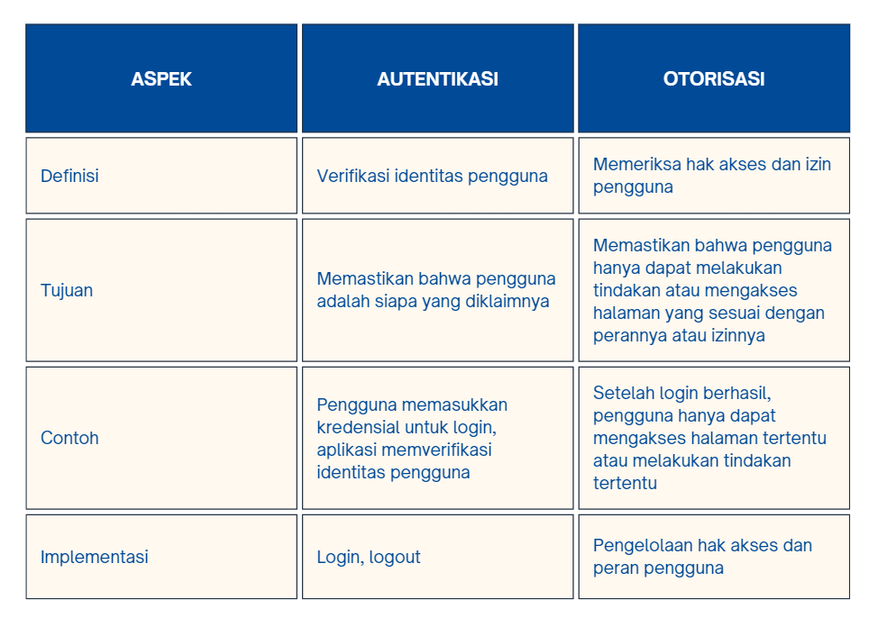

- Alasan mengapa keduanya penting:
    - Keamanan: Autentikasi memastikan bahwa hanya pengguna yang terotorisasi yang memiliki akses ke aplikasi. Otorisasi memastikan bahwa pengguna hanya memiliki akses ke fungsi atau data yang sesuai dengan peran atau izin mereka.
    - Perlindungan Data Sensitif: Autentikasi memastikan bahwa data sensitif hanya diakses oleh pengguna yang memiliki hak akses. Otorisasi memastikan bahwa pengguna hanya dapat melakukan tindakan tertentu terhadap data tersebut.
    - Manajemen Pengguna: Autentikasi memungkinkan aplikasi untuk mengidentifikasi dan membedakan pengguna. Otorisasi memungkinkan administrator untuk mengelola hak akses dan peran pengguna.
    - Pemisahan Tugas: Dengan autentikasi dan otorisasi yang kuat, pengembang dapat memisahkan tugas antara pengguna, administrator, dan pengelola sistem, sehingga meningkatkan keamanan dan manajemen aplikasi.

## Apa itu cookies dalam konteks aplikasi web, dan bagaimana Django menggunakan cookies untuk mengelola data sesi pengguna?
- Cookies dalam Konteks Aplikasi Web:
    Sebuah cookie adalah sepotong data kecil yang disimpan di komputer pengguna saat mengunjungi sebuah situs web. Cookies ini dikeluarkan oleh server web dan disimpan di browser pengguna. Tujuan utama cookies adalah untuk menyimpan informasi terkait sesi pengguna atau preferensi, sehingga situs web dapat mengingat informasi ini pada kunjungan berikutnya. Contoh informasi yang dapat disimpan dalam cookies meliputi preferensi bahasa, detail login, atau item yang ada dalam keranjang belanja. Dalam konteks aplikasi web, cookies memainkan peran penting dalam meningkatkan interaksi antara situs web dan pengguna. Mereka memungkinkan situs web untuk mengenali pengguna secara unik dan menyimpan informasi yang diperlukan untuk memberikan pengalaman yang lebih personal dan sesuai dengan preferensi masing-masing pengguna. Dengan menggunakan cookies, situs web dapat memberikan pengalaman yang lebih mulus dan disesuaikan bagi pengguna, serta membantu menyimpan informasi yang diperlukan untuk berbagai tujuan seperti analisis penggunaan situs, pengiklanan yang disesuaikan, dan lain sebagainya. Namun, pengguna harus diberikan pilihan untuk mengizinkan atau menolak penggunaan cookies, sesuai dengan kebijakan privasi dan regulasi yang berlaku. 

- Bagaimana Django Menggunakan Cookies untuk Mengelola Data Sesi Pengguna
    Django adalah sebuah kerangka kerja pengembangan web yang populer dan kuat yang memungkinkan pengembang untuk membangun aplikasi web dengan mudah. Django memiliki mekanisme bawaan untuk mengelola data sesi pengguna menggunakan cookie.Ketika pengguna pertama kali mengunjungi situs web yang menggunakan Django, server akan menghasilkan sebuah cookies khusus yang disebut sessionid. Cookies ini kemudian disimpan di browser pengguna. Django menggunakan sessionid untuk mengidentifikasi pengguna secara unik. Saat pengguna melakukan interaksi dengan situs web, Django menyimpan data sesi pengguna di server dan mengaitkannya dengan sessionid yang sesuai. Ini memungkinkan Django untuk menyimpan informasi sesi seperti data login, preferensi, atau halaman yang telah dilihat oleh pengguna. Proses ini memungkinkan Django untuk menyediakan pengalaman yang disesuaikan untuk pengguna yang masuk ke situs web, bahkan ketika mereka berpindah antar halaman atau melakukan tindakan tertentu.

## Apakah penggunaan cookies aman secara default dalam pengembangan web, atau apakah ada risiko potensial yang harus diwaspadai?
Penggunaan cookies tidak selalu aman secara default dalam pengembangan web, dan ada risiko potensial yang harus diwaspadai. Berikut adalah beberapa risiko terkait penggunaan cookies:

- Pelanggaran Privasi Pengguna: Cookies dapat digunakan untuk mengumpulkan dan melacak informasi pribadi pengguna tanpa izin mereka. Hal ini dapat mengakibatkan pelanggaran privasi dan dapat menimbulkan masalah hukum.

- Cross-Site Scripting (XSS) Attacks: Cookies yang tidak diatur dengan benar dapat menjadi rentan terhadap serangan XSS. Ini memungkinkan penyerang untuk memodifikasi atau mencuri cookies pengguna, yang dapat digunakan untuk mengakses akun atau informasi sensitif.

- Cross-Site Request Forgery (CSRF) Attacks: Cookies yang digunakan untuk otentikasi pengguna dapat dieksploitasi dalam serangan CSRF, di mana penyerang memaksa pengguna untuk melakukan aksi tertentu tanpa sepengetahuan mereka.

- Session Hijacking atau Session Fixation: Jika cookies sesi tidak diatur dengan benar atau tidak dijamin keamanannya, mereka dapat menjadi rentan terhadap serangan di mana penyerang mencoba mencuri atau menetapkan session ID pengguna.

- Man-in-the-Middle Attacks: Tanpa enkripsi yang cukup, cookies dapat dicegat oleh penyerang dalam serangan Man-in-the-Middle. Ini berarti penyerang dapat membaca atau mengubah informasi cookies saat transit.

- Cookies Theft atau Sniffing: Jika situs web tidak menggunakan protokol HTTPS, cookies dapat dengan mudah dicuri oleh penyerang yang memonitor lalu lintas jaringan.

- Overreliance on Cookies: Terlalu mengandalkan cookies untuk menyimpan informasi klien tanpa keamanan tambahan dapat mengakibatkan kerentanan atau kehilangan data jika cookies hilang atau rusak.

- Third-party Cookies Risks: Cookies dari pihak ketiga dapat digunakan untuk melacak perilaku pengguna di seluruh berbagai situs web, yang dapat menimbulkan risiko privasi yang signifikan.

## Jelaskan bagaimana cara kamu mengimplementasikan checklist di atas secara step-by-step (bukan hanya sekadar mengikuti tutorial).
- Mengimplementasikan fungsi registrasi, login, dan logout untuk memungkinkan pengguna untuk mengakses aplikasi sebelumnya dengan lancar.
    1. Registrasi Pengguna:
        - Pertama, di views.py pada direktori main, fungsi register dibuat. Fungsi ini menggunakan UserCreationForm untuk membuat formulir pendaftaran pengguna. 
        - Jika metode request adalah POST, formulir akan diisi dengan data dari permintaan dan diverifikasi. Jika formulir valid, data pengguna baru akan disimpan dan pengguna akan diarahkan ke halaman login dengan pesan sukses.
        - Jika formulir tidak valid, atau jika metode request bukan POST, maka formulir kosong akan disediakan untuk diisi oleh pengguna.
        - Formulir pendaftaran ini kemudian diintegrasikan dengan template register.html.
    2. Login Pengguna:
        - Fungsi login_user di views.py bertanggung jawab untuk memproses permintaan masuk dari pengguna.
        - Jika metode request adalah POST, pengguna dan kata sandi dari formulir login akan diekstraksi.
        - Kemudian, fungsi authenticate digunakan untuk memeriksa apakah kombinasi pengguna dan kata sandi valid. Jika valid, pengguna akan diarahkan ke halaman utama dengan pesan sukses. Jika tidak valid, pesan kesalahan akan ditampilkan.
        - Formulir login ini diintegrasikan dengan template login.html.
    3. Logout Pengguna:
        - Fungsi logout_user di views.py bertanggung jawab untuk memproses permintaan keluar dari pengguna.
        - Saat pengguna memilih untuk keluar, fungsi logout akan menghapus sesi pengguna yang saat ini masuk. Kemudian, pengguna akan diarahkan kembali ke halaman login.

- Membuat dua akun pengguna dengan masing-masing tiga dummy data menggunakan model yang telah dibuat pada aplikasi sebelumnya untuk setiap akun di lokal.
    1. Buat Akun Pertama:
        - Buka aplikasi Django Anda.
        - Kunjungi halaman registrasi dan isi formulir dengan informasi akun pertama.
        - Setelah pendaftaran berhasil, buka halaman admin Django dan masuk dengan akun admin.
        - Di bagian "Users", tambahkan dua akun pengguna baru, menggunakan informasi palsu jika diperlukan.
    2. Buat Akun Kedua:
        - Logout dari akun admin dan kembali ke halaman registrasi.
        - Daftar akun kedua dengan informasi yang berbeda.
        - Setelah pendaftaran berhasil, buka kembali halaman admin dan tambahkan tiga data dummy menggunakan akun kedua.

- Menghubungkan model Item dengan User.
    1. Tambahkan Impor User Model:
        - Pada file models.py di direktori main, tambahkan impor untuk model User dari django.contrib.auth.models.
    2. Tambahkan ForeignKey pada Model Item:
        - Pada model Item, tambahkan field user dengan menggunakan ForeignKey yang mengacu pada model User.
    3. Update Fungsi Create Item:
        - Di file views.py, pada fungsi create_item, setelah formulir valid dan sebelum menyimpan objek, atur field user pada objek Item yang akan disimpan dengan pengguna yang sedang masuk.
    4. Perbarui Fungsi show_main:
        - Di file views.py, pada fungsi show_main, ambil hanya item yang terasosiasi dengan pengguna yang sedang login.
    5. Lakukan Migrasi Model:
        - Jalankan perintah python manage.py makemigrations untuk membuat file migrasi baru.
    6. Terapkan Migrasi:
        Jalankan perintah python manage.py migrate untuk menerapkan perubahan pada model ke basis data.

- Menampilkan detail informasi pengguna yang sedang logged in seperti username dan menerapkan cookies seperti last login pada halaman utama aplikasi.
    1. Menampilkan Informasi Pengguna:
        - Di dalam fungsi show_main di views.py, tambahkan username pengguna yang sedang login ke dalam konteks.
        - Di dalam template main.html, tambahkan kode untuk menampilkan pesan selamat datang beserta nama pengguna.
    2. Menerapkan Cookies Last Login:
        - Di dalam fungsi login_user di views.py, setelah pengguna berhasil login, atur cookie 'last_login' dengan nilai waktu saat ini.
        - Di dalam template main.html, tambahkan kode untuk menampilkan informasi last login.

Referensi:
- https://pbp-fasilkom-ui.github.io/ganjil-2024/docs/tutorial-3
- https://www.sailpoint.com/identity-library/difference-between-authentication-and-authorization/#:~:text=Authentication%20is%20used%20to%20verify,for%20different%20types%20of%20users.
- https://data-flair.training/blogs/django-advantages-and-disadvantages/
- https://developer.mozilla.org/en-US/docs/Learn/Server-side/Django/Sessions
- https://www.trendmicro.com/vinfo/us/security/definition/cookies#:~:text=A%20cookie%20is%20a%20piece,returned%20to%20a%20particular%20website.
- https://www.devoteam.com/expert-view/cybersecurity-cookies/#:~:text=Cookies%20and%20cybercriminals,are%20stored%20in%20the%20browser.
- https://resources.infosecinstitute.com/topics/general-security/risk-associated-cookies/

## TUGAS 3
## Apa perbedaan antara form POST dan form GET dalam Django?
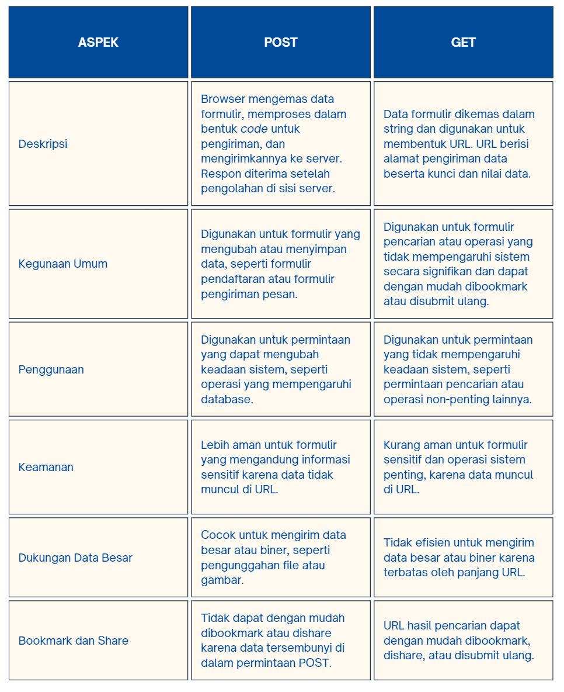

## Apa perbedaan utama antara XML, JSON, dan HTML dalam konteks pengiriman data?

Dalam konteks pengiriman data, XML dan JSON umumnya digunakan untuk mengirim dan menyimpan data, sementara HTML digunakan untuk mengatur dan menampilkan konten di browser. Pemilihan format tergantung pada kebutuhan dan penggunaan spesifik dari data yang akan dikirim atau disimpan. 
- XML (eXtensible Markup Language):
    - Tujuan Utama: XML digunakan untuk menyimpan dan mempertukarkan data terstruktur antar sistem. Ini memungkinkan untuk mendefinisikan struktur data khusus sesuai kebutuhan.
    - Keunggulan: Cocok untuk data yang kompleks dan terstruktur dengan kebutuhan validasi yang ketat. Dapat digunakan dalam berbagai konteks seperti konfigurasi, pertukaran data, dan penyimpanan terstruktur.
    - Kekurangan: Lebih berat dan kompleks dalam hal sintaksis, memerlukan lebih banyak karakter untuk mendefinisikan elemen dan struktur data. 

- JSON (JavaScript Object Notation):
    - Tujuan Utama: JSON terutama digunakan untuk pertukaran data di lingkungan yang lebih ringan dan efisien seperti web dan aplikasi seluler. Ini adalah format data ringan yang memanfaatkan sintaksis JavaScript.
    - Keunggulan: Lebih ringan dan lebih efisien dalam hal ukuran file dan penggunaan bandwidth. Memiliki format yang lebih mudah dibaca oleh manusia dan lebih mudah diproses oleh mesin.
    - Kekurangan: Tidak mendukung validasi bawaan, membutuhkan pendekatan manual untuk memastikan data sesuai dengan struktur yang diinginkan. 
    
- HTML (HyperText Markup Language):
    - Tujuan Utama: HTML digunakan untuk membuat struktur dan tata letak halaman web, serta menentukan cara konten disajikan di browser.
    - Keunggulan: Cocok untuk menampilkan konten dan interaksi pengguna di browser. Memiliki kemampuan bawaan untuk menampilkan gambar, video, tautan, formulir, dan elemen UI lainnya.
    - Kekurangan: Fokus utama pada presentasi dan tata letak, bukan penyimpanan atau pertukaran data terstruktur.

## Mengapa JSON sering digunakan dalam pertukaran data antara aplikasi web modern?
- Kesederhanaan dan Keterbacaan (Simplicity and Readability):
    JSON menggunakan struktur data yang sederhana dan mudah dipahami oleh manusia. Data disusun dalam format teks yang terorganisir dengan baik, membuatnya mudah untuk dibaca dan diinterpretasikan oleh pengembang dan mesin.

- Kesesuaian dan Interoperabilitas (Compatibility and Interoperability):
    JSON adalah format yang independen dari bahasa dan platform. Hal ini memungkinkan aplikasi yang ditulis dalam bahasa pemrograman yang berbeda untuk berkomunikasi dan bertukar data dengan mudah tanpa masalah kompatibilitas.

- Kinerja dan Efisiensi (Performance and Efficiency):
    JSON memiliki ukuran yang kecil dibandingkan dengan format pertukaran data lain seperti XML. Ini mengakibatkan pengiriman dan penerimaan data yang lebih cepat, menghemat waktu dan sumber daya jaringan.

- Keamanan dan Validasi (Security and Validation):
    JSON memungkinkan penggunaan metode validasi dan sanitasi data untuk memastikan bahwa data yang diterima adalah data yang benar dan aman. Pengguna dapat menerapkan kontrol keamanan tambahan seperti enkripsi untuk melindungi data.

- Fleksibilitas dan Ekstensibilitas (Flexibility and Extensibility):
    JSON mendukung struktur data yang fleksibel, memungkinkan pengembang untuk menyesuaikan format data sesuai dengan kebutuhan spesifik aplikasi. Jika diperlukan, dapat dengan mudah menambahkan atau mengubah atribut data tanpa mempengaruhi kompatibilitas dengan aplikasi lain.

- Kesesuaian dan Interoperabilitas (Compatibility and Interoperability):
    JSON kompatibel dengan sebagian besar bahasa pemrograman dan platform. Ini memungkinkan aplikasi yang ditulis dalam bahasa yang berbeda untuk saling berkomunikasi dan bertukar data tanpa mengalami kendala kompatibilitas.

## Jelaskan bagaimana cara kamu mengimplementasikan checklist di atas secara step-by-step (bukan hanya sekadar mengikuti tutorial).
- Membuat input form untuk menambahkan objek model pada app sebelumnya.
    1. Mengatur Routing dari main/ ke /
        - Buka berkas urls.py pada folder inventory_pbp.
        - Ubah path main/ menjadi '' pada urlpatterns.
        - Simpan perubahan dan jalankan server dengan perintah python manage.py runserver.
    2. Implementasi Skeleton sebagai Kerangka Views
        - Buat folder "templates" pada root folder.
        - Buat berkas base.html dengan kode template dasar yang telah disediakan.
        - Sesuaikan pengaturan TEMPLATES di berkas settings.py agar base.html terdeteksi sebagai berkas template.
        - Ubah kode berkas main.html pada direktori main menjadi menggunakan base.html sebagai template utama.
    3. Membuat Form Input Data dan Menampilkan Data Produk Pada HTML
        - Buat berkas forms.py pada direktori main untuk membuat struktur form ProductForm.
        - Buka berkas views.py di folder main dan tambahkan import yang diperlukan.
        - Tambahkan fungsi create_product untuk menangani form input data produk.
        - Modifikasi fungsi show_main untuk mengambil semua objek Product.
        - Tambahkan path URL untuk create_product di berkas urls.py di main.
        - Buat berkas create_product.html untuk menampilkan form input data produk.
    4. Menggunakan Form Input Data
        - Pada halaman utama, tampilkan data produk dalam bentuk tabel.
        - Tambahkan tombol "Add New Product" yang akan mengarahkan ke halaman form input data pada berkas main.html

- Tambahkan 5 fungsi views untuk melihat objek yang sudah ditambahkan dalam format HTML, XML, JSON, XML by ID, dan JSON by ID dan Membuat routing URL untuk masing-masing views yang telah ditambahkan pada poin 2.

    1. Menambahkan data dengan format HTML
        - Membuat folder templates di dalam direktori main
        - Di dalam folder templates, buat berkas HTML dan tambahkan kode HTML untuk menampilkan daftar produk.

    2. Mengembalikan Data dalam Bentuk XML
        - Buka views.py pada folder main.
        - Tambahkan import HttpResponse dan serializers di bagian paling atas.
        - Buat fungsi show_xml(request) untuk menampilkan data dalam format XML.
        - Di dalam fungsi show_xml, ambil semua data dari model Product.
        - Gunakan serializers.serialize() untuk mengubah data menjadi format XML.
        - Kembalikan response dengan parameter data hasil serialisasi dan tipe konten "application/xml".
        - Buka urls.py pada folder main dan impor fungsi yang baru saja dibuat.
        - Tambahkan path URL untuk mengakses fungsi show_xml.

    3. Mengembalikan Data dalam Bentuk JSON
        - Buka views.py pada folder main.
        - Tambahkan fungsi show_json(request) untuk menampilkan data dalam format JSON.
        - Di dalam fungsi show_json, ambil semua data dari model Product.
        - Gunakan serializers.serialize() untuk mengubah data menjadi format JSON.
        - Kembalikan response dengan parameter data hasil serialisasi dan tipe konten "application/json".
        - Buka urls.py pada folder main dan impor fungsi yang baru saja dibuat.
        - Tambahkan path URL untuk mengakses fungsi show_json.

    4. Mengembalikan Data Berdasarkan ID dalam Bentuk XML dan JSON
        - Buka views.py pada folder main.
        - Tambahkan dua fungsi baru, show_xml_by_id(request, id) dan show_json_by_id(request, id), untuk menampilkan data berdasarkan ID dalam format XML dan JSON.
        - Di dalam kedua fungsi tersebut, ambil data dari model Product berdasarkan ID.
        - Gunakan serializers.serialize() untuk mengubah data menjadi format XML atau JSON tergantung pada fungsi yang dipanggil.
        - Kembalikan response dengan parameter data hasil serialisasi dan tipe konten yang sesuai (XML atau JSON).
        - Buka urls.py pada folder main dan impor fungsi yang baru saja dibuat.
        - Tambahkan path URL untuk mengakses fungsi show_xml_by_id dan show_json_by_id dengan menyertakan parameter ID.

Referensi:
- https://docs.djangoproject.com/en/4.2/topics/forms/#:~:text=GET%20and%20POST&text=Django's%20login%20form%20is%20returned,this%20to%20compose%20a%20URL.
- https://www.w3schools.com/tags/ref_httpmethods.asp
- https://www.guru99.com/json-vs-xml-difference.html
- https://www.deltaxml.com/blog/xml/whats-the-relationship-between-xml-json-html-and-the-internet/
- https://www.linkedin.com/advice/3/what-benefits-drawbacks-using-json-data#:~:text=One%20of%20the%20main%20benefits,data%20format%20for%20web%20applications.
- https://brandmed.com/blog/development/the-power-of-json-whats-behind-the-popularity
- https://pbp-fasilkom-ui.github.io/ganjil-2024/docs/tutorial-2 

## Screenshot hasil akses URL pada Postman

- HTML
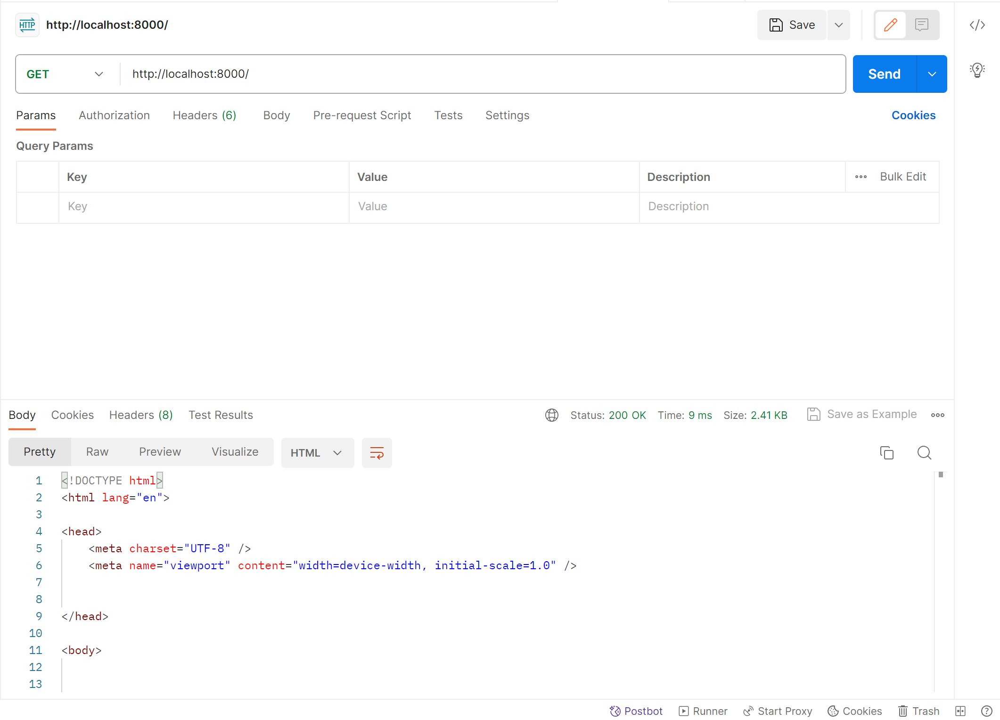

- XML
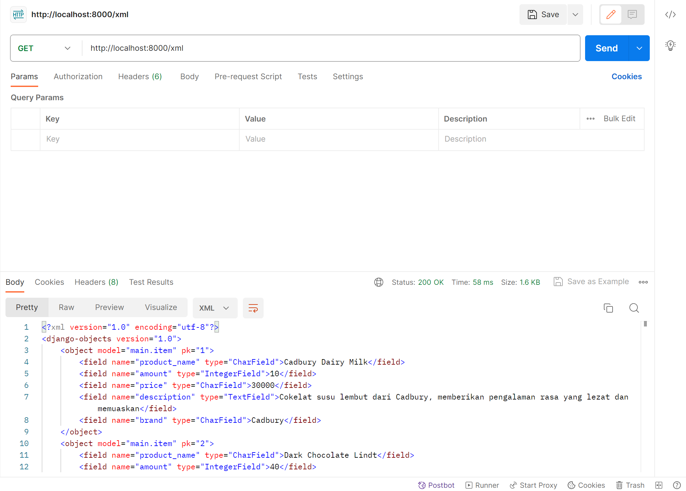

- JSON
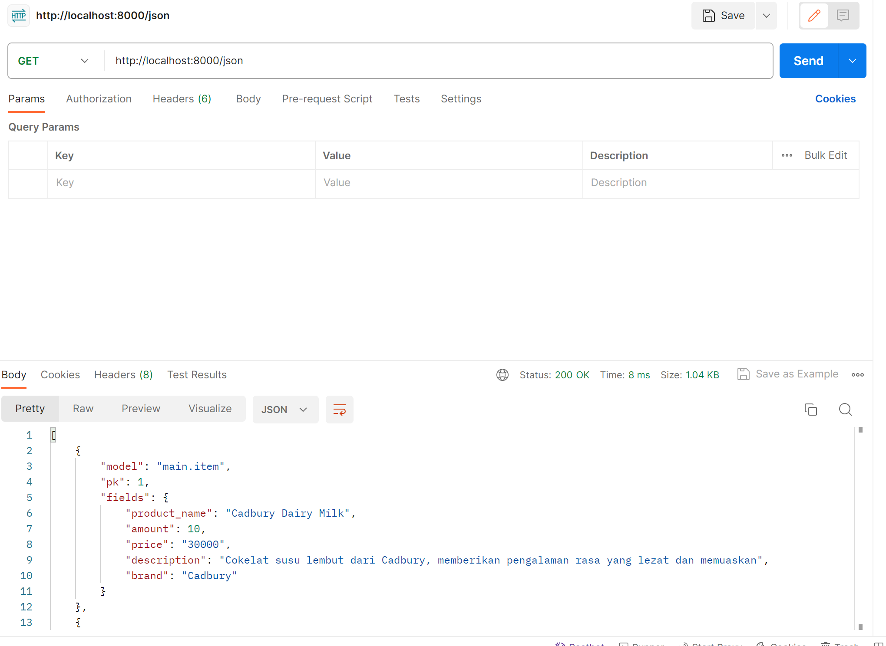

- XML by ID
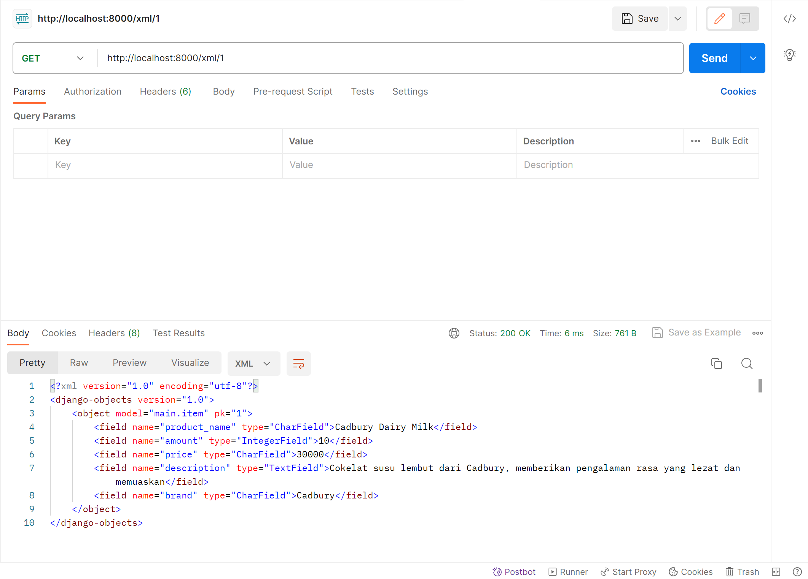

- JSON by ID
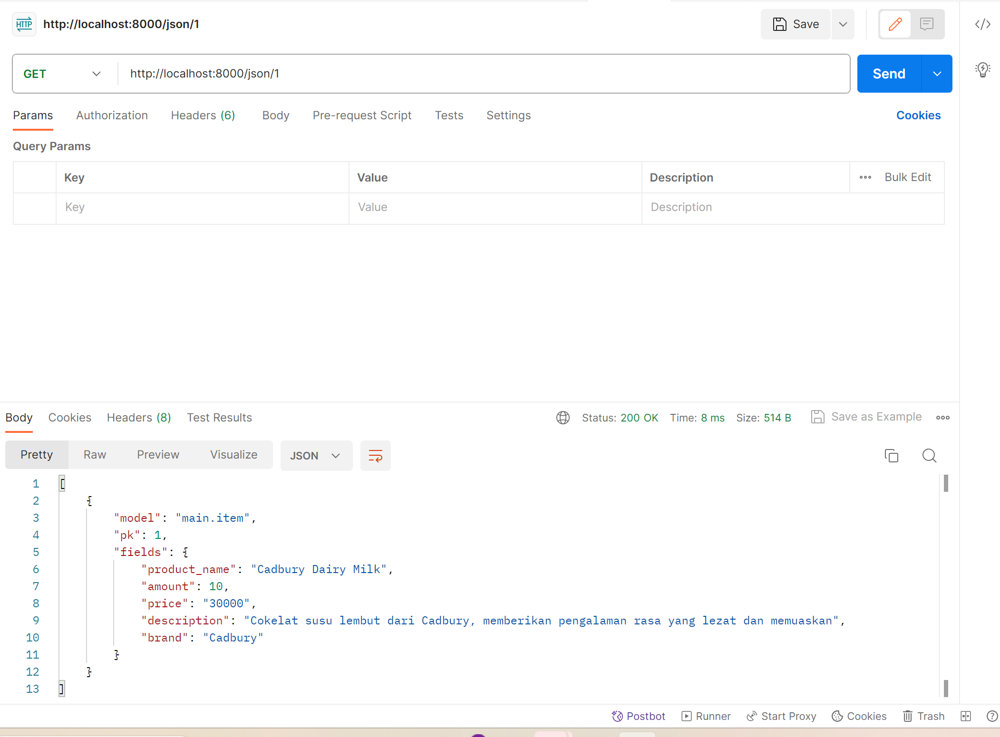

## TUGAS 2
## Jelaskan bagaimana cara kamu mengimplementasikan checklist di atas secara step-by-step (bukan hanya sekadar mengikuti tutorial)

- Membuat sebuah proyek Django baru.
    Langkah yang saya lakukan untuk membuat proyek Django baru adalah dengan: 
    1. Membuat Direktori dan Mengaktifkan Virtual Environment: membuat direktori untuk proyek Django Anda dan pindah ke dalamnya (nama direktori saya adalah inventory_pbp). Setelah itu, buat dan aktifkan virtual environment untuk memisahkan dependensi proyek ini dari proyek lain dengan menggunakan perintah python -m venv env dan env\Scripts\activate.bat

    2. Menyiapkan Dependencies dan Membuat Proyek Django: Lalu saya buat berkas requirements.txt dan menambahkan beberapa dependencies dan menjalankan virtual environment terlebih dahulu lalu menjalankan perintah pip install -r requirements.txt. Kemudian buka command prompt di direktori di mana ingin membuat proyek Django baru. Kemudian jalankan perintah django-admin startproject inventory_pbp . untuk membuat proyek Django baru dengan nama "inventory_pbp". Pastikan karakter . tertulis di akhir perintah untuk memastikan proyek dibuat dalam direktori saat ini.

    3. Konfigurasi Proyek dan menjalankan server: Buka file settings.py di dalam direktori proyek. Kemudian atur settings.py dengan menambahkan "*" di ALLOWED_HOSTS untuk keperluan deployment. Lalu jalankan server pengembangan dengan perintah python manage.py runserver. Setelah itu proyek Django akan berjalan di server pengembangan dan dapat diakses di http://localhost:8000/

    4. Menghentikan Server dan Menonaktifkan Virtual Environment: Lalu untuk menghentikan server pengembangan, tekan Ctrl + C di terminal tempat server berjalan dan untuk menonaktifkan virtual environment, jalankan perintah deactivate dari dalam direktori proyek.

- Membuat aplikasi dengan nama main pada proyek tersebut.
    Berdasarkan langkah yang sudah dijelaskan di atas, setelah proyek dibuat, maka perlu membuat aplikasi di dalamnya. Aplikasi ini akan memiliki fungsionalitas terkait dengan bagian utama dari proyek dengan menggunakan perintah python manage.py startapp main. Ini akan membuat direktori main dengan struktur dasar aplikasi Django di dalam proyek.

- Melakukan routing pada proyek agar dapat menjalankan aplikasi main.
    Pada langkah ini, buka file urls.py pada level proyek di dalam direktori main (bukan di dalam aplikasi). Tambahkan path baru untuk mengarahkan ke aplikasi 'main' yaitu dengan kode berikut:

    from django.urls import path
    from main.views import show_main
    app_name = 'main'
    urlpatterns = [
        path('', show_main, name='show_main'),
    ]

- Membuat model pada aplikasi main dengan nama Item dan memiliki atribut wajib sebagai berikut.
    name sebagai nama item dengan tipe CharField.
    amount sebagai jumlah item dengan tipe IntegerField.
    description sebagai deskripsi item dengan tipe TextField.

    Untuk membuat hal tersebut, buka file models.py di dalam aplikasi 'main' dan tambahkan model 'Item' dengan atribut yang diinginkan. Pada proyek saya, atributnya diantaranya adalah product_name, amount, description, price, dan brand. Lalu masing-masing atribut dibuat kedalam tipe data yang sesuai seperti CharField, DateField, IntegerField, dan TextField.

- Membuat sebuah fungsi pada views.py untuk dikembalikan ke dalam sebuah template HTML yang menampilkan nama aplikasi serta nama dan kelas kamu.
    Fungsi show_main mengambil parameter request, yang merupakan objek permintaan HTTP dari pengguna. Di dalamnya, terdapat dua variabel products, yang berisi informasi tentang produk-produk dalam bentuk dictionary (product_name, amount, description, price, dan brand). Selain itu, terdapat dua variabel tambahan nama_mahasiswa dan kelas yang berisi nama dan kelas mahasiswa. Selanjutnya, data-data ini diorganisir dalam sebuah context, yang akan diteruskan ke template. context terdiri dari tiga kunci, yaitu 'items' yang berisi produk-produk, 'nama_mahasiswa', dan 'kelas'. Terakhir, fungsi render digunakan untuk merender tampilan. Fungsi ini membutuhkan tiga argumen: request yang mewakili permintaan pengguna, "main.html" sebagai nama template yang akan digunakan, dan context yang mengandung data yang akan ditampilkan di tampilan HTML.
 

- Membuat sebuah routing pada urls.py aplikasi main untuk memetakan fungsi yang telah dibuat pada views.py.
    Membuat pengaturan rute pada berkas urls.py di aplikasi utama untuk menetapkan fungsi yang telah didefinisikan di views.py. Selanjutnya, tambahkan entri di berkas urls.py di direktori proyek dengan mengimpor fungsi include dari django.urls. Rute URL dari aplikasi lain dapat diarahkan menuju tampilan utama melalui variabel urlpatterns.

- Melakukan deployment ke Adaptable terhadap aplikasi yang sudah dibuat sehingga nantinya dapat diakses oleh teman-temanmu melalui Internet.
    Pertama, buatlah akun di Adaptable dan hubungkan akun tersebut dengan akun GitHub. Selanjutnya, buat aplikasi baru dan sambungkan dengan repositori GitHub yang sudah ada dengan memilih opsi "All Repositories" selama proses instalasi. Setelah itu, pilih repositori yang ingin di-deploy ke Adaptable, yaitu inventory_pbp. Gunakan Python App Template sebagai template deployment dan tentukan PostgreSQL sebagai tipe basis data yang akan digunakan. Pastikan versi Python sesuai dengan spesifikasi aplikasi dengan memeriksa versi Python melalui virtual environment dan menjalankan perintah "python --version". Tambahkan "python manage.py migrate && gunicorn inventory_pbp.wsgi" di bagian "Start Command". Selanjutnya, tentukan nama aplikasi yang akan menjadi domain untuk situs web aplikasi dan aktifkan HTTP Listener on PORT. Terakhir, klik tombol "Deploy App" dan proses deployment akan dimulai. Setelah proses selesai, maka sudah dapat mengakses aplikasi melalui Internet.

Tambahan:
- Melakukan testing Django (bisa dilakukan saat akhir)
    Saya melakukan 2 testing Django. Pertama, test_main_url_is_exist untuk menguji ketersediaan URL '/main/' dengan melakukan permintaan HTTP GET. Pengujian ini memeriksa apakah server memberikan respons dengan status kode 200, menunjukkan bahwa URL tersebut dapat diakses. Kedua, test_main_using_main_template memeriksa apakah tampilan menggunakan template 'main.html'. Dengan melakukan permintaan HTTP GET ke '/main/', pengujian ini memastikan bahwa tampilan mengakses template yang benar.

- Add, Push, dan Commit ke dalam Repositori GitHub (bisa dilakukan diawal setelah membuat direktori, ditengah, ataupun diakhir)
    Saya membuat repositori baru di GitHub dengan nama "inventory_pbp". Selanjutnya, saya membuat direktori baru dan menginisiasi penggunaan Git untuk menghubungkannya dengan repositori di GitHub. Selanjutnya dilakukan add, push, dan commit untuk setiap perubahan yang dilakukan agar selalu terupdate.

## Buatlah bagan yang berisi request client ke web aplikasi berbasis Django beserta responnya dan jelaskan pada bagan tersebut kaitan antara urls.py, views.py, models.py, dan berkas html.
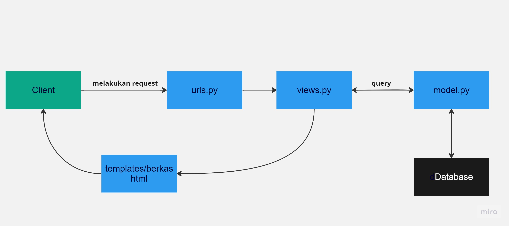

Alur permintaan dari client ke aplikasi web berbasis Django dimulai dengan pengguna mengajukan permintaan melalui antarmuka pengguna. Permintaan tersebut akan diteruskan melalui berkas urls.py, di mana pola URL akan dicocokkan. Setelah pencocokan berhasil, Django akan menunjuk ke view yang sesuai yang telah didefinisikan di views.py dan menjalankan fungsi views sesuai dengan yang direquest oleh client. Views kemudian dapat membutuhkan akses ke database, dalam hal ini, akan memanggil query ke models.py dan models.py mengambil data dari database. Hasil dari query akan dikirimkan kembali ke views untuk diproses lebih lanjut. Setelah proses permintaan selesai, hasilnya akan dimasukkan ke dalam berkas HTML yang sesuai dalam template. Terakhir, halaman web yang dihasilkan akan dikirimkan sebagai respon kembali kepada client

## Jelaskan mengapa kita menggunakan virtual environment? Apakah kita tetap dapat membuat aplikasi web berbasis Django tanpa menggunakan virtual environment?

Virtual environment digunakan dalam pengembangan perangkat lunak Python untuk mengisolasi paket dan dependensi dari suatu aplikasi. Hal ini penting karena memungkinkan pengembang untuk bekerja pada berbagai proyek dengan dependensi yang mungkin berbeda-beda tanpa terjadi konflik. Dengan menggunakan virtual environment, pastikan bahwa setiap proyek memiliki akses terhadap versi paket yang spesifik sesuai kebutuhan, tanpa mempengaruhi atau berinterferensi dengan proyek lain atau dengan versi package sistem.

Meskipun memungkinkan untuk membuat aplikasi web berbasis Django tanpa menggunakan virtual environment, namun tidak disarankan untuk membuat aplikasi web berbasis Django tanpa menggunakan virtual environment. Hal ini karena tanpa virtual environment, ada risiko terjadinya konflik versi dan masalah dependensi. Proyek Python yang berbeda mungkin memerlukan versi paket yang berbeda, dan tanpa isolasi yang diberikan oleh virtual environment, ini dapat menyebabkan kegagalan atau kerusakan pada proyek. Dengan menggunakan virtual environment, pengembang dapat menciptakan lingkungan pengembangan yang terisolasi, meminimalkan risiko konflik, dan memastikan stabilitas serta konsistensi proyek Python. Oleh karena itu, penggunaan virtual environment adalah praktik terbaik dalam pengembangan Python.

## Jelaskan apakah itu MVC, MVT, MVVM dan perbedaan dari ketiganya.
Penjelasan terkait apa itu MVC, MVT, dan MVVM:
- MVC:
    Model-View-Controller (MVC) adalah sebuah pola desain arsitektural yang digunakan dalam pengembangan perangkat lunak. Dalam MVC, aplikasi terbagi menjadi tiga komponen utama:
    - Model: Bertanggung jawab untuk mengelola data dan logika aplikasi. Ini mendefinisikan struktur data dan berurusan dengan operasi terkait data. Model juga tidak memiliki pengetahuan tentang tampilan atau pengguna yang memanfaatkannya.
    - View: Menampilkan data dari Model dan menghubungkannya dengan template atau antarmuka pengguna. View bertugas untuk mengatur tampilan dan mempresentasikan informasi kepada pengguna. Namun, View tidak menangani logika bisnis atau manipulasi data.
    - Controller: Bertindak sebagai perantara antara Model dan View. Controller menangani input dari pengguna, memprosesnya (biasanya dengan memanipulasi Model), dan memperbarui tampilan (View) sesuai dengan hasil dari proses tersebut.
    MVC memisahkan tanggung jawab antara tampilan, logika aplikasi, dan data, sehingga memungkinkan pengembang untuk bekerja secara terpisah pada setiap komponen. Hal ini menghasilkan kode yang lebih terstruktur, mudah dikelola, dan memungkinkan penggunaan kembali komponen-komponen tertentu dalam aplikasi yang berbeda.

- MVT:
    Konsep Model-View-Template (MVT) adalah struktur dasar yang sangat penting dalam pengembangan aplikasi web menggunakan framework Django di bahasa pemrograman Python. MVT membagi tugas utama dalam pengembangan menjadi tiga komponen utama: 
    - Model: berperan sebagai wadah untuk data dan logika aplikasi, memfasilitasi koneksi dengan basis data dan manipulasi data. 
    - View: bertanggung jawab atas logika presentasi, memproses permintaan dari pengguna, dan menyiapkan data untuk ditampilkan di antarmuka pengguna. 
    - Template: berfungsi untuk mendefinisikan tampilan antarmuka pengguna. 
    MVT akan berguna untuk mengembangkan dalam merancang aplikasi web yang terstruktur, mudah dikelola, serta memungkinkan penggunaan kembali kode dalam berbagai bagian aplikasi. MVT memungkinkan pemisahan tugas yang jelas antara Model, View, dan Template. Ini memungkinkan pengembang untuk bekerja pada setiap komponen secara terpisah. Selain itu, MVT juga memfasilitasi penggunaan kembali kode di berbagai bagian aplikasi, menghemat waktu dan sumber daya pengembangan. Dengan struktur MVT, pengembang dapat merancang aplikasi yang lebih terstruktur, mudah dikelola, serta siap untuk berkembang mengikuti kebutuhan yang berubah.

- MVVM:
    Konsep Model-View-ViewModel (MVVM) adalah sebuah arsitektur perangkat lunak yang sering digunakan dalam pengembangan aplikasi berbasis antarmuka pengguna, terutama dalam konteks pengembangan aplikasi berbasis framework seperti WPF (Windows Presentation Foundation) untuk aplikasi desktop dan Xamarin untuk pengembangan aplikasi lintas platform. MVVM membagi aplikasi menjadi tiga komponen utama:
    - Model: Mirip dengan konsep MVT, Model dalam MVVM bertanggung jawab untuk mengelola data dan logika bisnis. Ini mewakili struktur data dan mengatur interaksi dengan basis data atau sumber data lainnya.
    - View: View dalam MVVM adalah antarmuka pengguna yang menampilkan data dan berinteraksi dengan pengguna. Ini mencakup elemen UI seperti tombol, formulir, dan elemen tampilan lainnya.
    - ViewModel: ViewModel adalah komponen penting yang membedakan MVVM dari MVT. ViewModel berperan sebagai penghubung antara Model dan View. Ini mengambil data dari Model dan mempersiapkannya agar sesuai untuk ditampilkan di View. ViewModel juga

Perbedaan MVC, MVT, dan MVVM:
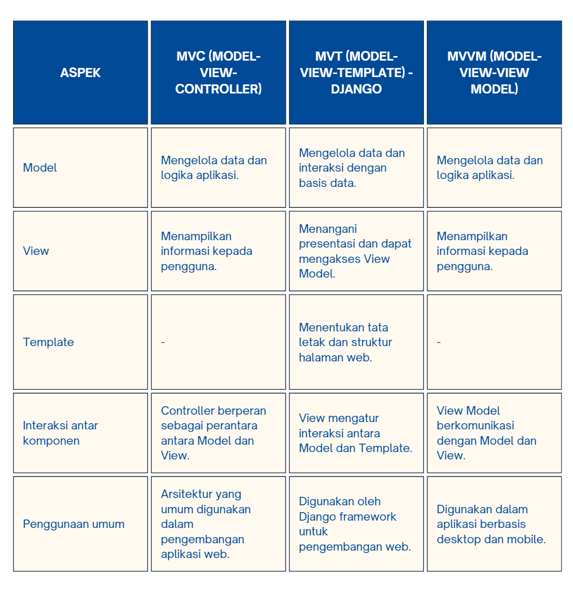

Referensi:
- https://www.guru99.com/mvc-vs-mvvm.html
- https://levelup.gitconnected.com/mvc-vs-mvp-vs-mvvm-35e0d4b933b4
- https://pbp-fasilkom-ui.github.io/ganjil-2024/
- https://www.geeksforgeeks.org/python-virtual-environment/

    

        
